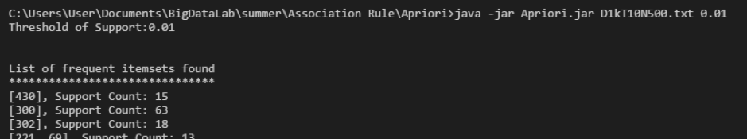

# Apriori-Java

## 程式執行介面

若只需要找到Frequent Itemsets，輸入以下指令到命令提示字元：

```
$ java -jar Apriori.jar [dataset file path] [minimum support]
```


若同時需要找到Association Rule，則須加上`[minimum confidence]`參數：

```
$ java -jar Apriori.jar [dataset file path] [minimum support] [minimum confidence]
```

若需要將找到的結果輸出到一個文字檔中，則須加上 `> [output file]`：
```
$ java -jar Apriori.jar ... > [output file]
```

下圖為範例示意截圖



## 實作上遇到的問題與使用到的方法

在開發中，比較多的時間都在思考應該用什麼樣的方式才能最大限度地減少執行時間及記憶體，所以使用了 $F_{k-1}\times F_{k-1}$ 的候選產生方式，雖然這樣的方式在產生候選的過程可能要花比較多時間，但在計算Support Count的時候可以只計算較少數量的候選。

而在實作Support Counting時，因為時間關係，我沒有來得及實作Candidate Hash Tree。我的作法是將每一筆候選都進行排序，這樣它們在和一開始就先排序好的transactions之間比對時，就不需要原本的 $O(N^2)$ 的時間而只需要最多$O(NlogN)$的時間，這裡$N$是transaction中的最大物件數量。

## 實驗結果

這裡的實驗結果會和[FP-Growth實作](https://github.com/Chih-Ling-Hsu/FPGrowth-Java)的表現進行比較。

### 以`D1kT10N500.txt`做為資料集輸入


### 以`D10kT10N1k.txt`做為資料集輸入


### 以`D100kT10N1k.txt`做為資料集輸入


### 以`Mushroom.txt`做為資料集輸入


